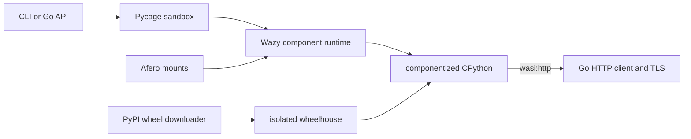

<p align="center">
  
</p>

<h1 align="center">pycage</h1>

<p align="center">
  <a href="https://github.com/samyfodil/pycage/actions/workflows/ci.yml"></a>
  <a href="https://pkg.go.dev/github.com/samyfodil/pycage"></a>
  <a href="LICENSE"></a>
</p>

<p align="center">
  Run untrusted Python — real CPython, not a subset.<br>
  No container. No daemon. No root. No kernel to escape.
</p>

```console
$ pycage run 'print("hello from CPython"); sum(i * i for i in range(10))'
hello from CPython
285
```

Pycage runs CPython 3.14 in your own process on
[Wazy](https://github.com/samyfodil/wazy) — a pure-Go WebAssembly runtime with a
native amd64/arm64 compiler, WASI Preview 2, and full Component Model support.
Wazy is what makes any of this possible: no cgo, no container runtime, no host
Python, one static binary that cross-compiles everywhere Go does.

Pycage is the policy layer on top — capabilities, limits, filesystems, packages —
and a Go library first, a CLI second.

## Why not a container?

|  | pycage | container |
| --- | --- | --- |
| Fresh isolated sandbox | **~21 ms** (0.6 ms per warm cell) | process + image + namespace setup |
| Runtime dependency | none — one static Go binary | daemon, root or rootless plumbing |
| Isolation boundary | Wasm: the guest can only call host functions pycage imports | the shared host kernel |
| Default capabilities | **none** — no network, no host FS, no subprocess | network namespace, `/proc`, caps |
| Platforms | linux, macOS, Windows × amd64, arm64 | Linux (a VM everywhere else) |
| Deployment | in-process, `import` it | out-of-process, orchestrate it |

Startup figures are measured on Linux/amd64 (i9-12900HK) with a warm
compilation cache; see [docs/benchmarks.md](docs/benchmarks.md) for the full
method and the one-time cold-compile cost.

### Isolation

A container shares the host kernel, so isolation depends on the kernel and the
container runtime having no exploitable bugs. A WebAssembly guest has no
syscall interface at all: it can only call the functions the host explicitly
imports. Pycage imports a filesystem you choose and, optionally, `wasi:http`.

Everything is deny-by-default. A zero-value `pycage.Config` gives Python no
network, no host filesystem, and no view of the machine it runs on. Subprocesses,
shells, and native extensions aren't disabled by policy — they are not present
in the guest to begin with.

The trade is real and worth stating: the boundary you are trusting becomes
Wazy's correctness instead of the kernel's. That is a far smaller and more
auditable surface, but it is a different bet, not a free one. Pycage has not
been independently audited. Wall-clock and memory are capped; CPU is not
accounted for. For actively hostile code, keep OS-level limits underneath.

## A free, self-hosted alternative to E2B

pycage does the same job as a hosted code-execution sandbox — run an agent's
Python somewhere it cannot hurt you — with no account, no bill, and no
infrastructure to operate. It is Apache-2.0, it is one Go binary, and the sandbox
runs inside your own process. `pycage serve` speaks E2B's own SDK protocol, so
pointing an existing integration at it is a URL change.

| | isolation | self-host | needs | license |
| --- | --- | --- | --- | --- |
| **pycage** | Wasm, in-process | yes | nothing | Apache-2.0 |
| [E2B](https://github.com/e2b-dev/E2B) | Firecracker microVM | yes | Terraform + AWS or GCP | Apache-2.0 |
| [Modal](https://modal.com) sandboxes | managed, hosted | no | a Modal account | proprietary |
| [Judge0](https://github.com/judge0/judge0) | container | yes | Docker | GPL-3.0 |
| [Piston](https://github.com/engineer-man/piston) | container | yes | Docker | MIT |
| [Pyodide](https://pyodide.org) | Wasm, in-process | yes | a JS engine | MPL-2.0 |

E2B is open source too, but its self-hosting guide deploys through Terraform to
AWS or GCP and lists Azure and plain Linux machines as unsupported. That is the
practical difference: self-hosting E2B means standing up cloud infrastructure,
self-hosting pycage means `go get`.

The honest trade is scope. E2B hands you a Linux VM — a shell, a package manager,
native extensions, GPUs. pycage hands you CPython and pure-Python packages, and
nothing else exists inside the guest. If you need `apt install` or PyTorch, take
the VM. If you need to run a model's Python in milliseconds without operating a
cluster, that is this.

## What you get

- Real CPython packaged as a WebAssembly component with `componentize-py`.
- Stateful cells with captured output, tracebacks, and rich results.
- Pure-Python wheels and embedded pip with host-verified PyPI downloads.
- HTTPS through standard `wasi:http`, backed by Go's TLS stack.
- In-memory, host-bound, read-only, and copy-on-write Afero mounts.
- Native Wazy compilation cache for fast repeat starts.

## Quick start

As a library — the CPython component ships in the module, so this is all you
need. Go 1.26 or newer, and no Python on the host:

```console
go get github.com/samyfodil/pycage
```

As a CLI:

```console
go install github.com/samyfodil/pycage/cmd/pycage@latest
pycage run '6 * 7'
```

To rebuild the guest component yourself you additionally need Python 3.10+ and
GNU Make. `make build` creates `.venv`, installs the pinned `componentize-py`,
regenerates `guest/python.wasm`, and compresses it to the `guest/python.wasm.gz` that
is embedded in the binary.

## Packages and HTTPS

Runtime package installation accepts pure `*-none-any.whl` packages. Network
access is opt-in:

```console
pycage run \
  -timeout 60s \
  -network \
  -pip 'requests==2.32.4' \
  -pip 'six==1.17.0' \
  'import requests, six; response = requests.get("https://example.com/"); print(response.status_code); print(six.text_type("dependencies work")); response.text[:40]'
```

Pycage resolves package metadata and downloads wheels through the trusted Go
host. Downloads are restricted to PyPI, checked against PyPI's SHA-256 digest,
and staged for embedded pip. Native extensions, source distributions, unsafe
archive paths, and console scripts are rejected or removed.

Componentized CPython does not include `_ssl`. Pycage therefore mounts a
requests transport over `wasi:http/outgoing-handler`; Wazy sends the request
through Go's certificate-verifying `http.Client`. The lower-level
`pycage_http.get()` API uses the same path.

## Filesystems

The default filesystem is private to one sandbox: an Afero in-memory writable
layer over a temporary backing directory. No host path is visible by default.

Bind a directory with write-through behavior:

```console
pycage run \
  -bind '/srv/agent-workspace=/workspace' \
  'open("/workspace/result.txt", "w").write("done")'
```

Expose host files with memory-only copy-on-write changes:

```console
pycage run \
  -bind-cow '/srv/package-base=/packages' \
  'open("/packages/config.json").read()'
```

Installed packages can persist across processes by binding a host directory to
`/site-packages`:

```console
mkdir -p site-packages
pycage run \
  -network \
  -bind './site-packages=/site-packages' \
  -pip 'six==1.17.0' \
  'import six; six.__version__'
```

## How it works



The WIT boundary exports `run-code`, `install-modules`, and `reset`, and imports
standard WASI HTTP. The Go host owns lifecycle, policy, filesystem routing,
package validation, deadlines, and memory limits. Wazy is consumed directly
through `go.mod`; pycage does not vendor or locally patch it.

## Go API

Use `New` for one sandbox:

```go
ctx := context.Background()
config := pycage.DefaultConfig()

sandbox, err := pycage.New(ctx, config)
if err != nil {
    log.Fatal(err)
}
defer sandbox.Close(ctx)

_, _ = sandbox.RunCode(ctx, "x = 40")
result, _ := sandbox.RunCode(ctx, "x + 2")
fmt.Println(result.Text()) // 42
```

For a service, reuse an `Engine` so compilation and decoded component state are
shared while each sandbox keeps independent Python globals and files:

```go
engine, err := pycage.NewEngine(ctx, pycage.DefaultConfig())
if err != nil {
    log.Fatal(err)
}
defer engine.Close(ctx)

sandbox, err := engine.NewSandbox(ctx)
if err != nil {
    log.Fatal(err)
}
defer sandbox.Close(ctx)
```

See [examples/langchain-agent](examples/langchain-agent) for the same sandbox
wired up as a [langchaingo](https://github.com/tmc/langchaingo) tool.

Configure custom Afero mounts:

```go
config := pycage.DefaultConfig()
config.FileSystem = pycage.StaticFileSystem(
    pycage.Mount("/", afero.NewMemMapFs()),
    pycage.Bind("/workspace", "/srv/agent-workspace"),
    pycage.CopyOnWrite(
        "/packages",
        afero.NewBasePathFs(afero.NewOsFs(), "/srv/package-base"),
        afero.NewMemMapFs(),
    ),
)
```

`StaticFileSystem` shares the supplied Afero instances between sandboxes. Use a
custom `FileSystemFactory` when every sandbox needs fresh mounts, and
`ReadOnlyMount` for immutable capabilities.

## Server mode

`pycage serve` exposes an `Engine` over E2B's code-interpreter HTTP API, so
E2B's own SDKs drive it unmodified:

```console
pycage serve                     # 127.0.0.1:49999, E2B's port
```

```python
from e2b_code_interpreter import Sandbox

sandbox = connect("http://127.0.0.1:49999")   # see examples/e2b-python
execution = sandbox.run_code("import math; math.factorial(20)")
print(execution.text)                          # 2432902008176640000
```

One E2B *context* is one pycage *sandbox*: independent Python globals, an
independent filesystem, and all of them sharing the Engine's compiled component.
Contexts are capped by `-max-contexts` and reclaimed after `-idle-timeout`, so a
client that forgets to delete one cannot leak it.

| Method | Path | |
| --- | --- | --- |
| `POST` | `/execute` | run a cell, stream NDJSON frames |
| `POST` | `/contexts` | create a context |
| `GET` | `/contexts` | list contexts |
| `DELETE` | `/contexts/{id}` | destroy a context |
| `GET` | `/health` | liveness, never requires a token |

pycage implements E2B's data plane, not its control plane: there is no cloud API
to allocate machines, so `Sandbox.create()` has nothing to call. Point the SDK at
pycage instead — [examples](examples) shows the three-line helper for Python and
TypeScript.

The server binds to loopback and requires no token by default. Set `-token`
before exposing it anywhere else; it is then required in `X-Access-Token`.

Output is not incremental. pycage's guest returns a cell's effects when the cell
finishes, so a client that accumulates frames sees identical results, while one
that renders partial output watches it all land at once.

## CLI reference

```text
pycage run [options] 'python code'

  -timeout 5s          execution deadline
  -memory 268435456    WebAssembly memory limit in bytes
  -runtime compiler    compiler or interpreter
  -cache-dir path      native compilation cache directory
  -network             enable outbound TCP and HTTP
  -wheel path          install a local pure-Python wheel; repeatable
  -pip requirement     install a package through embedded pip; repeatable
  -bind host=guest     writable host-directory mount; repeatable
  -bind-cow host=guest host-backed mount with memory-only writes; repeatable
  -timing              print setup and execution timings
  -json                print the complete structured result

pycage serve [options]

  -addr 127.0.0.1:49999  listen address
  -token value           require this value in X-Access-Token
  -max-contexts 32       maximum simultaneous Python contexts
  -idle-timeout 10m      close a context after this much inactivity
  -timeout 30s           execution deadline per cell
  -memory 268435456      WebAssembly memory limit per context
  -runtime compiler      compiler or interpreter
  -cache-dir path        native compilation cache directory
  -network               enable outbound TCP and HTTP for every context
  -bind host=guest       writable host-directory mount; repeatable
  -bind-cow host=guest   host-backed mount with memory-only writes; repeatable
```

Compiler mode is the default. Native compiled modules are cached beneath
`${TMPDIR:-/tmp}/pycage/wazy-native`, keyed by component and Wazy version.
Interpreter mode is opt-in for disposable cold starts:

```console
pycage run -runtime interpreter -timing '6 * 7'
```

See [docs/benchmarks.md](docs/benchmarks.md) for measured startup and warm-call
costs.

## Capability defaults

| Capability | Default | Opt-in |
| --- | --- | --- |
| Host filesystem | Denied | `Mount`, `Bind`, `-bind`, `-bind-cow` |
| TCP and HTTP(S) | Denied | `AllowNetwork`, `-network` |
| Runtime packages | Local wheel only | `PipInstall`, `-pip` with networking |
| Execution time | 5 seconds | `Config.Timeout`, `-timeout` |
| Wasm memory | 256 MiB | `Config.MemoryLimitBytes`, `-memory` |
| Subprocesses | Unavailable | Not supported |
| Native extensions | Rejected | Not supported |

## Current limitations

- Only pure-Python wheels are supported, and a package is unreachable when any
  transitive dependency lacks a `-none-any` wheel. MarkupSafe and pydantic-core
  have never published one, so Jinja2, Werkzeug, Flask, and Pydantic stay out of
  reach even though the top-level package is often pure Python itself.
- Raw `socket` use under a denied network traps the instance rather than raising:
  the sandbox is retired and the caller gets a Wasm stack trace. HTTP and
  read-only filesystem denials do raise catchable Python exceptions. Sockets are
  left structurally unwired on purpose — refusing them in a host callback would
  be a weaker guarantee than never exposing the interface.
- `PipInstall` restarts the CPython instance once the packages land, so Python
  globals defined before the install do not survive it. Install first, then run.
- CPython `_ssl`, subprocesses, native extensions, and shell commands are not
  present in the guest.
- The requests adapter currently buffers responses and does not expose response
  headers, proxies, custom client certificates, or `verify=False`.
- Explicit IPv6 socket bind remains disabled pending the componentized CPython
  socket-adapter fix.
- General guest `os.utime` awaits Wazy's WASI `descriptor.set-times-at`.
- A cold native compile is expensive; reuse `Engine` or the disk cache.

Implementation details and exact upstream gaps are tracked in
[docs/wazy-compatibility.md](docs/wazy-compatibility.md).

## Development

```console
make test
make bench
```

Generated artifacts (`.venv`, `guest/python.wasm`, and `bin/`) are ignored. See
[CONTRIBUTING.md](CONTRIBUTING.md) for the development workflow and
[SECURITY.md](SECURITY.md) for vulnerability reporting.

## License

Apache-2.0. See [LICENSE](LICENSE) and [NOTICE](NOTICE).
