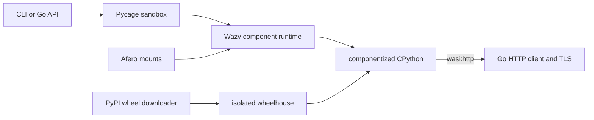

# pycage

[](https://github.com/samyfodil/pycage/actions/workflows/ci.yml)
[](https://pkg.go.dev/github.com/samyfodil/pycage)
[](LICENSE)

An embedded Python sandbox for running AI-generated code with real CPython,
[Wazy](https://github.com/samyfodil/wazy), WebAssembly components, and no
Python subprocess at runtime.

```console
$ ./bin/pycage run 'print("hello from CPython"); sum(i * i for i in range(10))'
hello from CPython
285
```

Pycage is an early prototype for E2B-like workloads that need a local,
embeddable execution boundary. It provides stateful Python cells, memory and
time limits, capability-gated networking, pure-Python package installation,
and mountable Afero filesystems.

## Why pycage?

- Real CPython packaged as a WebAssembly component with `componentize-py`.
- Embedded Go API and standalone CLI; no container or remote service required.
- Network and host filesystem access denied unless explicitly enabled.
- Stateful cells with captured output, tracebacks, and rich results.
- Pure-Python wheels and embedded pip with host-verified PyPI downloads.
- HTTPS through standard `wasi:http`, backed by Go's TLS stack.
- In-memory, host-bound, read-only, and copy-on-write Afero mounts.
- Native Wazy compilation cache for fast repeat CLI starts.

## Quick start

Requirements:

- Go 1.26 or newer
- Python 3.10 or newer, needed only to build the embedded component
- GNU Make

```console
git clone https://github.com/samyfodil/pycage.git
cd pycage
make build

./bin/pycage run '6 * 7'
```

The first build creates `.venv`, installs the pinned `componentize-py`, builds
`guest/app.wasm`, and embeds it in `bin/pycage`. Running the resulting binary
does not require a host Python installation.

## Packages and HTTPS

Runtime package installation accepts pure `*-none-any.whl` packages. Network
access is opt-in:

```console
./bin/pycage run \
  -timeout 60s \
  -network \
  -pip 'requests==2.32.4' \
  -pip 'six==1.17.0' \
  'import requests, six; response = requests.get("https://example.com/"); print(response.status_code); print(six.text_type("dependencies work")); response.text[:40]'
```

Pycage resolves package metadata and downloads wheels through the trusted Go
host. Downloads are restricted to PyPI, checked against PyPI's SHA-256 digest,
and staged for embedded pip. Native extensions, source distributions, unsafe
archive paths, and console scripts are rejected or removed.

Componentized CPython does not include `_ssl`. Pycage therefore mounts a
requests transport over `wasi:http/outgoing-handler`; Wazy sends the request
through Go's certificate-verifying `http.Client`. The lower-level
`pycage_http.get()` API uses the same path.

## Filesystems

The default filesystem is private to one sandbox: an Afero in-memory writable
layer over a temporary backing directory. No host path is visible by default.

Bind a directory with write-through behavior:

```console
./bin/pycage run \
  -bind '/srv/agent-workspace=/workspace' \
  'open("/workspace/result.txt", "w").write("done")'
```

Expose host files with memory-only copy-on-write changes:

```console
./bin/pycage run \
  -bind-cow '/srv/package-base=/packages' \
  'open("/packages/config.json").read()'
```

Installed packages can persist across processes by binding a host directory to
`/site-packages`:

```console
mkdir -p site-packages
./bin/pycage run \
  -network \
  -bind './site-packages=/site-packages' \
  -pip 'six==1.17.0' \
  'import six; six.__version__'
```

## How it works



The WIT boundary exports `run-code`, `install-modules`, and `reset`, and imports
standard WASI HTTP. The Go host owns lifecycle, policy, filesystem routing,
package validation, deadlines, and memory limits. Wazy is consumed directly
through `go.mod`; pycage does not vendor or locally patch it.

## Go API

Use `New` for one sandbox:

```go
ctx := context.Background()
config := pycage.DefaultConfig()

sandbox, err := pycage.New(ctx, config)
if err != nil {
    log.Fatal(err)
}
defer sandbox.Close(ctx)

_, _ = sandbox.RunCode(ctx, "x = 40")
result, _ := sandbox.RunCode(ctx, "x + 2")
fmt.Println(result.Text()) // 42
```

For a service, reuse an `Engine` so compilation and decoded component state are
shared while each sandbox keeps independent Python globals and files:

```go
engine, err := pycage.NewEngine(ctx, pycage.DefaultConfig())
if err != nil {
    log.Fatal(err)
}
defer engine.Close(ctx)

sandbox, err := engine.NewSandbox(ctx)
if err != nil {
    log.Fatal(err)
}
defer sandbox.Close(ctx)
```

Configure custom Afero mounts:

```go
config := pycage.DefaultConfig()
config.FileSystem = pycage.StaticFileSystem(
    pycage.Mount("/", afero.NewMemMapFs()),
    pycage.Bind("/workspace", "/srv/agent-workspace"),
    pycage.CopyOnWrite(
        "/packages",
        afero.NewBasePathFs(afero.NewOsFs(), "/srv/package-base"),
        afero.NewMemMapFs(),
    ),
)
```

`StaticFileSystem` shares the supplied Afero instances between sandboxes. Use a
custom `FileSystemFactory` when every sandbox needs fresh mounts, and
`ReadOnlyMount` for immutable capabilities.

## CLI reference

```text
pycage run [options] 'python code'

  -timeout 5s          execution deadline
  -memory 268435456    WebAssembly memory limit in bytes
  -runtime compiler    compiler or interpreter
  -cache-dir path      native compilation cache directory
  -network             enable outbound TCP and HTTP
  -wheel path          install a local pure-Python wheel; repeatable
  -pip requirement     install a package through embedded pip; repeatable
  -bind host=guest     writable host-directory mount; repeatable
  -bind-cow host=guest host-backed mount with memory-only writes; repeatable
  -timing              print setup and execution timings
  -json                print the complete structured result
```

Compiler mode is the default. Native compiled modules are cached beneath
`${TMPDIR:-/tmp}/pycage/wazy-native`, keyed by component and Wazy version.
Interpreter mode is opt-in for disposable cold starts:

```console
./bin/pycage run -runtime interpreter -timing '6 * 7'
```

See [docs/benchmarks.md](docs/benchmarks.md) for measured startup and warm-call
costs.

## Capability defaults

| Capability | Default | Opt-in |
| --- | --- | --- |
| Host filesystem | Denied | `Mount`, `Bind`, `-bind`, `-bind-cow` |
| TCP and HTTP(S) | Denied | `AllowNetwork`, `-network` |
| Runtime packages | Local wheel only | `PipInstall`, `-pip` with networking |
| Execution time | 5 seconds | `Config.Timeout`, `-timeout` |
| Wasm memory | 256 MiB | `Config.MemoryLimitBytes`, `-memory` |
| Subprocesses | Unavailable | Not supported |
| Native extensions | Rejected | Not supported |

## Current limitations

Pycage is not yet a hardened production security boundary. Run hostile code
only with additional process-level isolation and resource controls.

- Only pure-Python wheels are supported.
- CPython `_ssl`, subprocesses, native extensions, and shell commands are not
  present in the guest.
- The requests adapter currently buffers responses and does not expose response
  headers, proxies, custom client certificates, or `verify=False`.
- Explicit IPv6 socket bind remains disabled pending the componentized CPython
  socket-adapter fix.
- General guest `os.utime` awaits Wazy's WASI `descriptor.set-times-at`.
- A cold native compile is expensive; reuse `Engine` or the disk cache.

Implementation details and exact upstream gaps are tracked in
[docs/wazy-compatibility.md](docs/wazy-compatibility.md).

## Development

```console
make test
make bench
```

Generated artifacts (`.venv`, `guest/app.wasm`, and `bin/`) are ignored. See
[CONTRIBUTING.md](CONTRIBUTING.md) for the development workflow and
[SECURITY.md](SECURITY.md) for vulnerability reporting.

## License

Apache-2.0. See [LICENSE](LICENSE) and [NOTICE](NOTICE).
